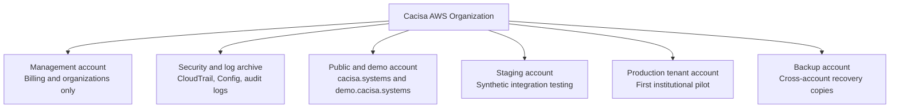
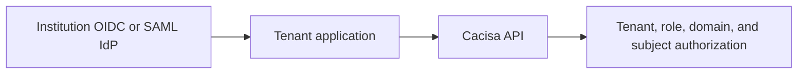

# AWS Platform Architecture

Cacisa can run most product infrastructure on AWS, but AWS is the substrate,
not the architecture of institutional reasoning. The application must remain
portable: containerized services, PostgreSQL, standard OIDC/SAML identity,
Terraform-managed infrastructure, S3-compatible storage boundaries, and
Cacisa-controlled policy artefacts.

## Account Model

Use AWS Organizations as the security, billing, and failure boundary.



Before a live institutional pilot, the lean version may combine public, demo,
and staging in one non-production account. A real production institution should
have a dedicated account, VPC, database, buckets, KMS keys, state file, logs,
and backup boundary.

## Surfaces

| Surface | Preferred boundary | Data allowed |
| --- | --- | --- |
| `cacisa.systems` | Static public site in a public/demo account | Public company and product information only |
| `demo.cacisa.systems` | Real engine deployment with synthetic-only data | Fictional policies, fictional subjects, synthetic documents |
| `staging.cacisa.systems` | Production-shaped test stack | Synthetic or formally approved test data only |
| `{tenant}.app.cacisa.systems` or institution-owned domain | Dedicated tenant account for serious production pilots | Approved tenant data only |
| `ops.cacisa.systems` | Provider account/control plane | Provider metadata, deployment status, approved support access records |
| `status.cacisa.systems` | Separate account, preferably independent failure boundary | Availability and incident status only |

The public company site must have no path to production databases, no product
cookies, no production API credentials, no student identifiers, and no tenant
analytics. The demo environment must carry a permanent synthetic-data boundary
and must not accept real transcripts or institutional documents.

## Runtime Stack

The deployable API/worker tier is:

- ECS Fargate for the FastAPI API, workers, migration task, and retention task.
- RDS PostgreSQL as the authoritative operational database.
- S3 for source documents, evidence attachments, policy artefacts, and exports.
- SQS as the low-latency wakeup signal channel for background workers.
- PostgreSQL `background_jobs` as the transaction-authoritative job ledger.
- ElastiCache Redis for idempotency, rate limits, short-lived coordination, and
  cache needs only.
- Secrets Manager for runtime secrets.
- KMS for storage, queue, secret, and log encryption.
- CloudWatch logs and alarms.

SQS does not contain source text, evidence bytes, policy payloads, or subject
records. It carries only job identifiers so workers can wake up and then claim
work through tenant-scoped PostgreSQL leases.

## Identity Boundary

The institution authenticates its users. Cacisa authorizes what those users can
do inside the governed workspace.



Cognito may be used as a federation bridge if the institution wants that
pattern, but it is not the conceptual owner of institutional identity.

## Provider Operations

`ops.cacisa.systems` must not become an unrestricted window into tenant records.
Provider access should have three levels:

| Level | Access |
| --- | --- |
| Normal operations | Deployment status, tenant lifecycle metadata, no personal data |
| Approved support | Time-limited, case-scoped technical records |
| Break-glass | MFA, reason, approval, immutable logging, and post-incident review |

Provider access to a tenant account should use cross-account roles rather than
long-lived IAM users.

## Data Location Inventory

Do not simply claim "hosted in South Africa." Each deployment must maintain a
data-flow inventory for:

- application data;
- authentication claims;
- IP addresses and CDN request metadata;
- security logs;
- email metadata;
- backup copies;
- operational telemetry;
- support records;
- exported artefacts.

Route 53, CloudFront, CloudFront-scoped ACM certificates, and WAF for CloudFront
use global AWS control planes. That does not automatically mean institutional
records leave the primary region, but the distinction must be documented.

## Build And Promotion

Build the container image once, push it to ECR, and promote the same image digest
through:

```text
demo -> staging -> tenant production
```

Promotion may change configuration, environment state, and approved policy
artefacts. It must not rebuild a different production image after staging
approval.

## Current Repo Mapping

The current Terraform stack in `deploy/terraform` provisions the tenant API and
worker tier for one environment/account. It now includes:

- ECS Fargate API, worker, migration, and retention task definitions;
- private RDS PostgreSQL;
- private encrypted Redis;
- private versioned S3 evidence/source bucket;
- SQS background-job signal queue and DLQ;
- Secrets Manager runtime secrets;
- KMS key;
- ALB and Route 53 API hostname;
- least-privilege worker SQS consumption role.

Static public/demo/tenant/provider frontend hosting, AWS Organizations account
creation, central log archive, cross-account backup, status page hosting, and
institutional IdP registration remain deployment work outside this module.

## Non-Negotiable Boundary

AWS hosts the platform. Cacisa owns the institutional reasoning architecture.
Each institution retains authority over its rules, identities, evidence, and
decisions.
